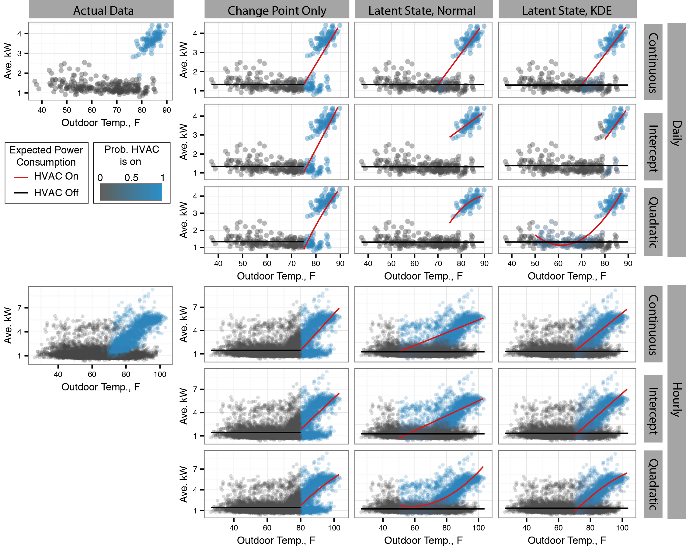

# HVACdisagg

This repository contains a general algorithm for disaggregating energy consumed for 
heating and cooling loads from whole-home energy consumption measured at the utility meter. 
The general algorithm allows for different model forms as described in the accompanying publication
and explained in this overview. 

## Getting Started

The file functions/HVACdisagg.R contains two functions: classModelFit and validateFit. 
Simply source this file to access these functions. 

TrialRun.R is an example script for using the functions. PecanDataLoad.R fetches and processes pecan street 
data for testing the algorithm. This requires an adacemic license to the pecan street dataport, which is avaiable from http://www.pecanstreet.org/.
Write your username and password for the dataport into a file names pecankeys.keys in the home directory, with your username
on the first line and your password on the second. Alternatively one can enter their password directly into the PecanDataLoad.R

### Prerequisites

There are no prerequisites for the mdoel fitting functions. 
TrialRun.R requires ggplot2. PecanDataLoad.R requires RPostgreSQL. 

## Using the model
The figure below displays examples of different model forms fit to daily and hourly data.

Inputs to the model include 
data: dataframe containing power consumption data, temperature data, and other load regressors. 

## Authors

* **Michaelangelo Tabone** 
* **Mark Dyson**
* **Duncan Callaway**

See also the list of [contributors](https://github.com/your/project/contributors) who participated in this project.

## License

This project is licensed under the MIT License - see the [LICENSE.md](LICENSE.md) file for details

## Acknowledgments

* 
